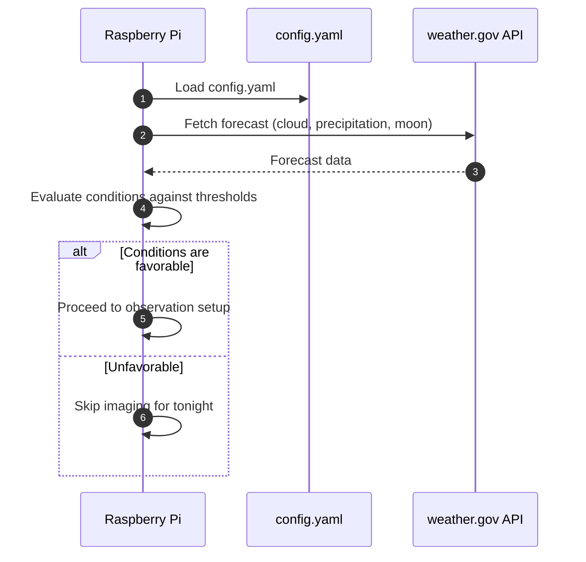
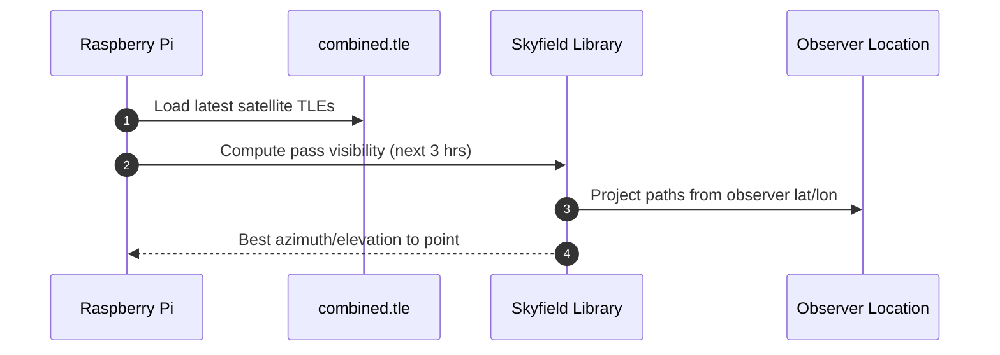
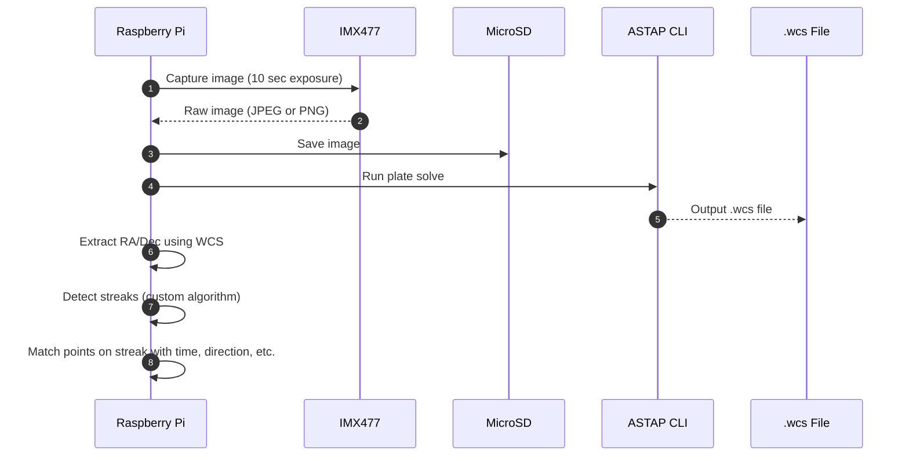
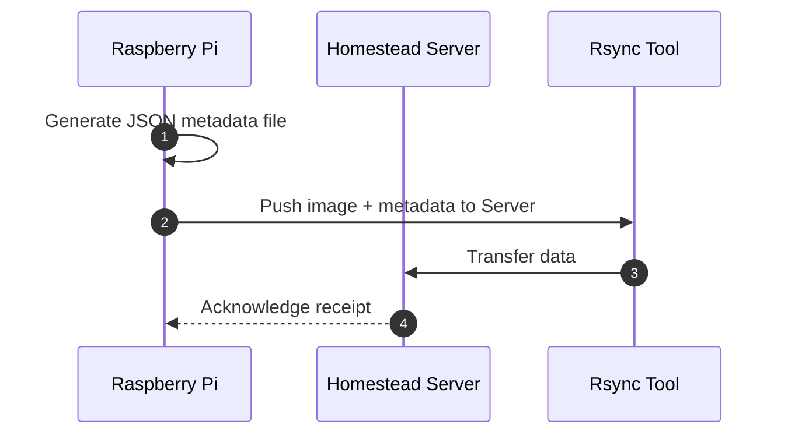
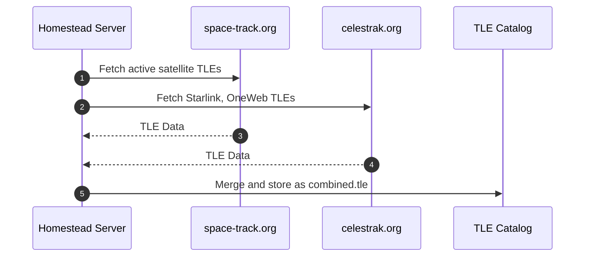
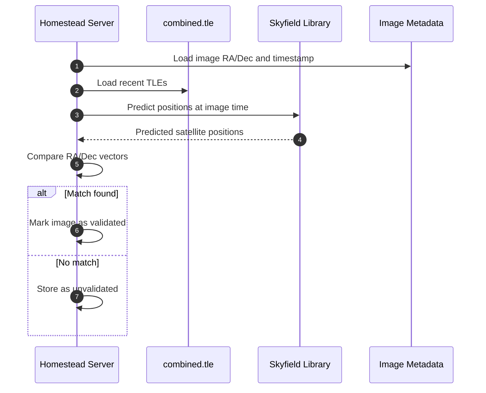
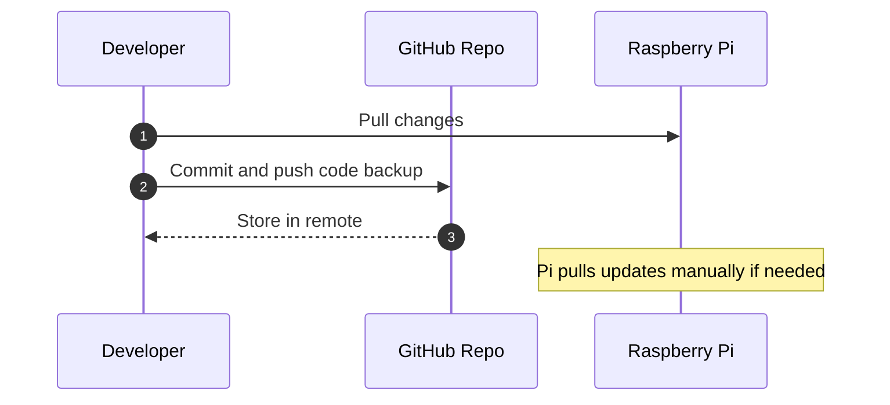

# UPHDAS Sequence Diagrams (Mermaid Format)

This document contains all detailed sequence diagrams for the Unified Public Highschool Distributed Astrophotography System (UPHDAS), written in Mermaid format. These cover operations including weather checks, pass predictions, image capture, streak processing, data upload, and TLE updates.

---

## 1. Pi Daily Startup Routine

---

## 2. Satellite Pass Prediction

---

## 3. Image Capture and Streak Detection

---

## 4. Metadata Generation & Rsync Upload

---

## 5. TLE Update on Server

---

## 6. Image Validation and Matching (Server-Side)

---

## 7. GitHub Dev Pipeline (Manual Backup)

---
