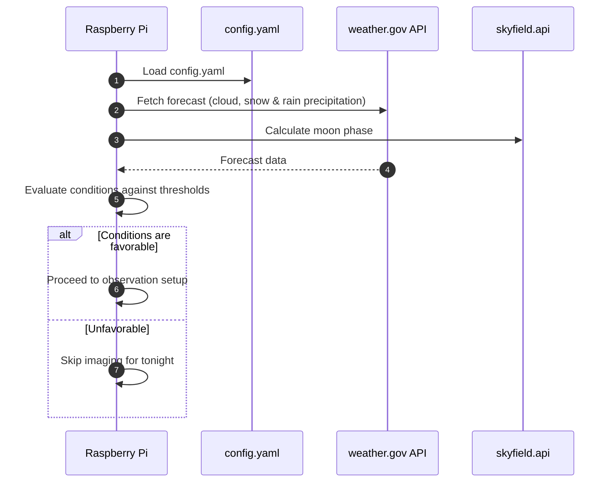
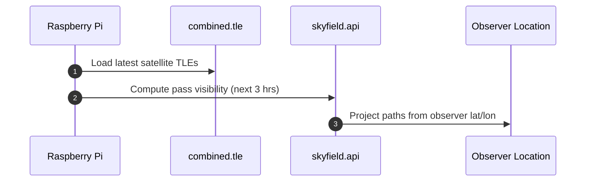
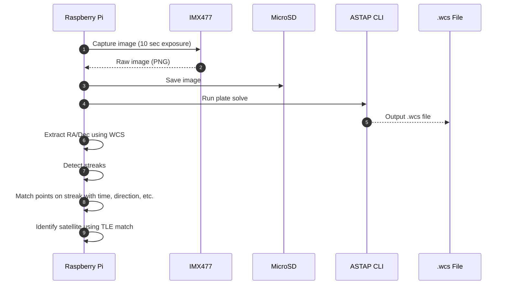
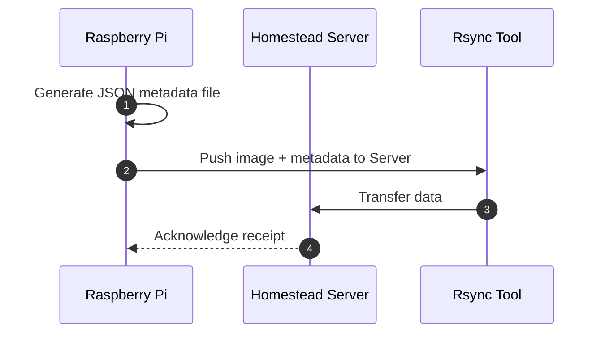
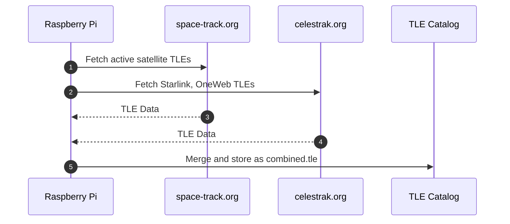
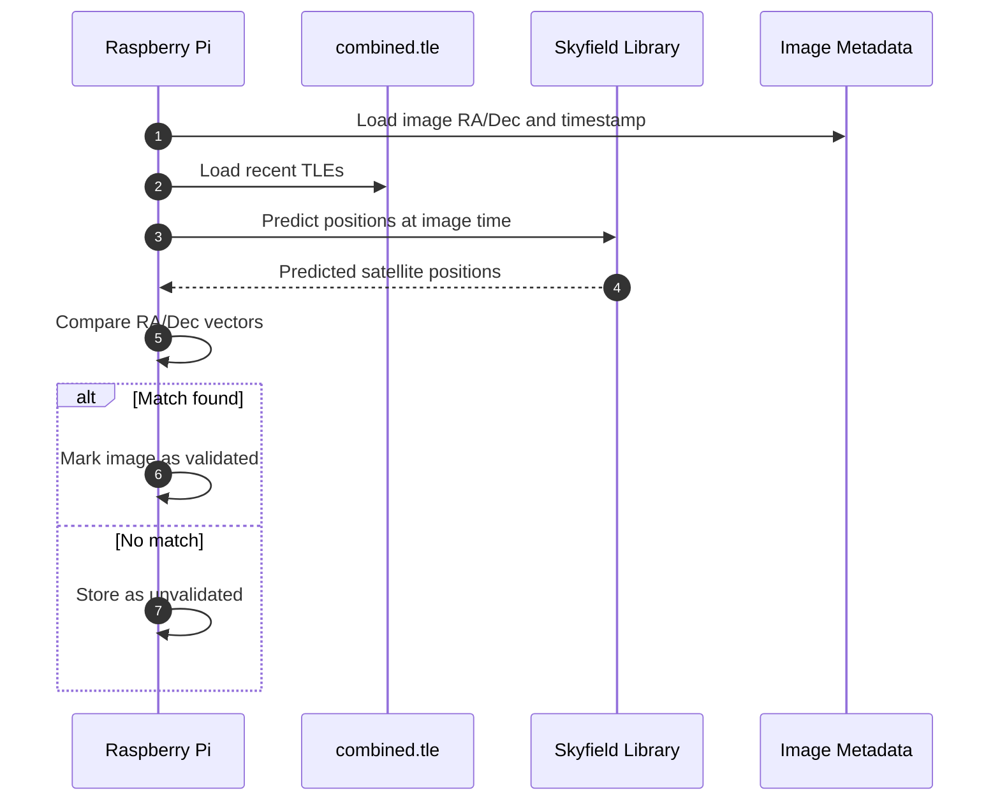

# UPHDAS Sequence Diagrams

This document contains all detailed sequence diagrams for UPHDAS, written in Mermaid format (a markdown language). These cover operations such as the weather check, pass prediction, image capture, streak processing, data upload, and TLE update.

---

## 1. Pi Daily Startup Routine

---

## 2. Satellite Pass Prediction

---

## 3. Image Capture and Streak Detection

---

## 4. Metadata Generation & Rsync Upload

---

## 5. TLE Update on Pi

---

## 6. Image Validation and Matching (on Pi)

---
